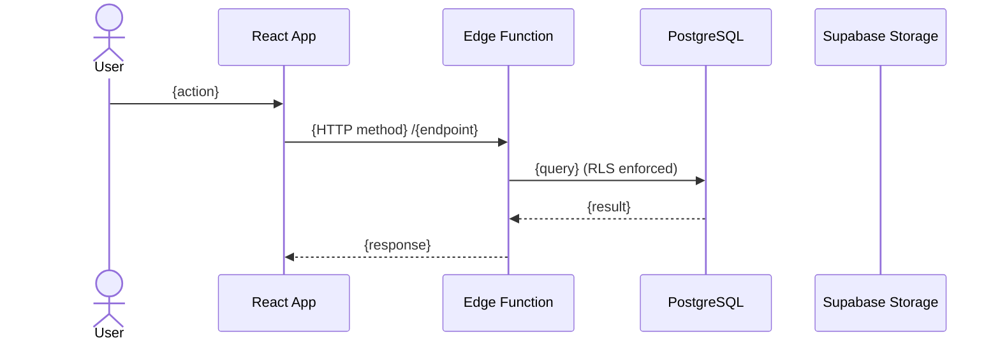

## Purpose

You are a sub-agent responsible for MODULE DESIGN. You take a reviewed PRD and produce a comprehensive Module Design Document (MDD) that covers screens (with wireframes), database schema, API contracts, storage design, and architecture decisions. The MDD is the bridge between "what to build" (PRD) and "how to code it" (SDD).

The MDD IS the architecture document. Sections 4-9 (Data Model, Business Logic Rules, API Contract, Storage, Sync, Feature Flags) + Section 11 (ADRs) cover the complete module architecture.

## What You Receive

From the orchestrator:
- Change name (e.g., "registro-fotografico")
- Artifact store mode (`engram | openspec | none`)

## Execution and Persistence Contract

Read and follow `skills/_shared/persistence-contract.md` for mode resolution rules.

- If mode is `engram`: Read and follow `skills/_shared/engram-convention.md`. Artifact type: `module-design`. Retrieve `prd` and `prd-review` as dependencies.
- If mode is `openspec`: Read and follow `skills/_shared/openspec-convention.md`.
- If mode is `none`: Return result only. Never create or modify project files.

### Retrieving Dependencies

Load required artifacts using the active convention:

**Required:**
- `sdd/{change-name}/prd` — The PRD (REQUIRED — abort if missing)
- `sdd/{change-name}/prd-review` — The review report (REQUIRED — abort if status was "blocked")

**Optional:**
- `sdd-init/{project}` — Project context. If not found, read the project's CLAUDE.md directly as fallback for stack context. Do NOT abort.

### Mode Detection

This skill has TWO modes with smart detection:
- **CREATE**: When `sdd/{change-name}/module-design` does NOT exist in Engram → generate from scratch
- **EDIT**: When `sdd/{change-name}/module-design` ALREADY exists → show current MDD, ask user what to change

The orchestrator does NOT need to specify the mode. The skill detects it automatically.

## What to Do

### Mode: CREATE

#### Step 1: Read Existing Codebase Patterns

MANDATORY before generating. Read the actual codebase to understand existing patterns:

```
SCAN:
├── src/pages/             → routing patterns, page structure, existing modules
├── src/components/        → component organization per module, naming conventions
├── src/hooks/             → React Query patterns (useQuery, useMutation, queryKeys)
├── src/services/          → API client patterns
├── src/contexts/          → state management patterns
├── supabase/functions/    → Hono router pattern (routes/services/schemas structure)
├── supabase/migrations/   → RLS patterns (get_user_tenant, has_role), indexes, naming
├── supabase/functions/_shared/    → shared services (auth, points, budget, errors, CORS)
├── supabase/functions/*/index.ts  → edge function router patterns, middleware stack
└── docs/                  → existing module documentation
```

Focus on:
- How existing modules structure their pages (e.g., `src/pages/growth/Entrenamientos.tsx`)
- How components are organized (e.g., `src/components/trainings/`)
- How Edge Functions use Hono with routes/, services/, schemas/ subdirectories
- How RLS policies use `get_user_tenant(auth.uid())` and `has_role()`
- Recent migration naming conventions and patterns
- What shared services exist in _shared/ and what they do (for section 5.2)
- Auth flow pattern: JWT → getUser() → get_user_tenant() → authenticated + admin clients
- Points/budget integration chain (if module handles points)
- Notification patterns (email via Resend edge functions)
- Feature flag pattern: is_feature_enabled() RPC + ModuleGuard frontend component

#### Step 2: Generate Module Design Document

Produce a complete MDD with up to 14 sections. Sections 7, 8, and 14 are CONDITIONAL.

```markdown
# Module Design: {Module Name}

**Change:** {change-name}
**PRD:** sdd/{change-name}/prd
**Date:** {ISO date}

---

## 1. Screen Map

| ID | Screen | Route | Platform | Roles | Key Components |
|----|--------|-------|----------|-------|----------------|
| S-01 | {name} | /{path} | {Web/Mobile} | {roles} | {ComponentA, ComponentB} |

### 1.1 Navigation Flow

```
[S-01 {Name}] ──{action}──→ [S-02 {Name}]
    │                              │
    ├──{action}──→ [S-03 {Name}]  ├──{action}──→ [S-01 refresh]
    └──{action}──→ [S-01 filtered] └──{action}──→ [S-01 refresh]
```

### 1.2 Sequence Diagrams

For flows involving ≥3 systems (App → Edge Function → DB → Storage → AI):



MANDATORY when: file uploads, async processing, AI integration, or multi-step workflows.

### 1.3 Wireframes ASCII

For each screen, labeled [BACKOFFICE] or [APP]:

#### S-01: {Screen Name} [{BACKOFFICE|APP}]
```
┌─────────────────────────────────────────────┐
│ [{Header/FilterBar components}]             │
├─────────────────────────────────────────────┤
│ [{Main content area with real field names}] │
│ [{Table rows / cards / forms as needed}]    │
├─────────────────────────────────────────────┤
│ [{Actions / pagination / footer}]           │
└─────────────────────────────────────────────┘
```

Use real component names from shadcn/ui (Table, Card, Button, Select, Input, etc.).
Show actual data field names, not lorem ipsum.

### 1.4 Screen Details

For each screen:
- **Layout:** Description of the layout structure
- **Key interactions:** What the user can do
- **Data dependencies:** What data must be loaded, from where

## 2. Component Inventory

| Component | Type | Library | New/Existing | Reused from | Notes |
|-----------|------|---------|-------------|-------------|-------|
| {name} | {page/shared/domain} | {shadcn/custom} | {New/Existing} | {module/ or "-"} | {notes} |

## 3. Data Binding Map

| Screen | UI Element | Data Source | Endpoint / Query Key | Field Mapping |
|--------|-----------|-------------|---------------------|---------------|
| S-01 | {element} | {API/Cache/Context} | {GET /path or queryKey} | {response.field → prop} |

## 4. Data Model

For each new or modified table:

### Table: {table_name}

```sql
CREATE TABLE public.{table_name} (
    id uuid PRIMARY KEY DEFAULT gen_random_uuid(),
    tenant_id uuid NOT NULL REFERENCES public.tenants(id) ON DELETE CASCADE,
    -- domain columns with types, constraints, defaults
    created_at timestamptz NOT NULL DEFAULT now(),
    updated_at timestamptz NOT NULL DEFAULT now(),
    CONSTRAINT {constraint_name} UNIQUE(tenant_id, {field})
);
```

#### RLS Policies

```sql
ALTER TABLE public.{table_name} ENABLE ROW LEVEL SECURITY;

CREATE POLICY "Users can view {table} in their tenant"
ON public.{table_name} FOR SELECT TO authenticated
USING (tenant_id = get_user_tenant(auth.uid()));

CREATE POLICY "Admins can manage {table}"
ON public.{table_name} FOR ALL TO authenticated
USING (
    tenant_id = get_user_tenant(auth.uid())
    AND (has_role(auth.uid(), tenant_id, 'admin'::app_role)
         OR has_role(auth.uid(), tenant_id, 'manager'::app_role))
);
```

#### Indexes

```sql
CREATE INDEX idx_{table}_tenant ON public.{table_name}(tenant_id);
CREATE INDEX idx_{table}_{common_filter} ON public.{table_name}(tenant_id, {field}) WHERE {condition};
```

#### Triggers

```sql
CREATE TRIGGER update_{table}_updated_at
    BEFORE UPDATE ON public.{table_name}
    FOR EACH ROW EXECUTE FUNCTION public.update_updated_at_column();
```

### Entity Relationships

```
{table_a} 1──N {table_b} (via {fk_column})
{table_b} N──1 {table_c} (via {fk_column})
```

## 5. Business Logic Rules

Maps PRD business rules to their technical implementation. This is the bridge between "what the PRD says" and "how the code enforces it."

| PRD Business Rule | Implementation | Where Enforced | Values |
|-------------------|---------------|----------------|--------|
| {rule from PRD Business Rules section} | {how it's implemented technically} | {DB constraint / Edge Function middleware / Frontend validation} | {specific values: limits, thresholds, amounts} |

Example:
| PRD Business Rule | Implementation | Where Enforced | Values |
|-------------------|---------------|----------------|--------|
| Prevent peer abuse | Daily transaction counter | Edge Function middleware | 5 txn/day per user |
| Monthly peer budget | Allowance with auto-reset | DB + cron job | 50 pts/month, reset day 1 |
| No self-recognition | Giver ≠ recipient check | DB CHECK constraint | giver_id ≠ recipient_id |

This section absorbs ALL specific values, thresholds, and technical implementation details that the PRD intentionally omits. The PRD says "prevent abuse" — this section says "5 txn/day with counter in DB."

### 5.1 Data Flow Sequences

**CONDITIONAL — include when a User Story has >3 system interactions, transactional behavior, or failure modes that need explicit handling. Skip for simple CRUD operations.**

For each critical flow, document the complete sequence from user action to final result:

#### Flow: {US-XXX — description}
**Surface:** [APP] / [BACKOFFICE] / [BOTH]

```
1. [Frontend] User {action}
2. [Frontend] Validate input (Zod schema)
3. [Edge Function] Auth: extract JWT → getUser() → get_user_tenant()
4. [Edge Function] Rate limit check
5. [Edge Function] Business validation ({specific validation})
6. [Database] {query/mutation} (RLS enforced)
7. [Edge Function] {next step}
...N. [Frontend] {final UI update}

If fails at step N: {what happens to previous steps}
```

**Shared services used:** {list from _shared/ directory}

### 5.2 Integration with Platform Services

**ALWAYS include — every module integrates with existing services.**

The sub-agent in Step 1 discovers shared services in `supabase/functions/_shared/` and existing patterns. Document which ones this module uses:

| Service | Location | What It Does | How This Module Uses It |
|---------|----------|-------------|------------------------|
| {discovered service} | {path} | {purpose} | {how this module calls it} |

Common shared services to check for:
- Auth utilities (supabase-client.ts, auth-utils.ts)
- CORS middleware (cors.ts)
- Points/budget system (recognition-validator.ts, recognition-issuer.ts, budget-release.ts)
- Notification services (email edge functions)
- Error handling (error response helpers)

If the module needs a shared service that doesn't exist, document it as "NEW — needs to be created in _shared/".

### 5.3 Idempotency & Failure Handling

**CONDITIONAL — include when the module modifies balances, budgets, points, or any data where partial failure leaves inconsistent state. Skip for read-only or configuration modules.**

**Duplicate Prevention:**
{Strategy — e.g., idempotency key in request, unique index in DB, or client-side debounce}

**Partial Failure Handling:**
For flow {US-XXX}:
- If fails after step {N} (e.g., after budget deducted but before points credited):
  {Recovery strategy — rollback function, compensating transaction, or manual reconciliation}

**Non-reversible Operations:**
| Operation | Why Not Reversible | Mitigation |
|-----------|-------------------|------------|
| {operation} | {reason} | {what to do instead} |

## 6. API Contract

### Edge Function: {function-name}

**Base path:** `/{function-name}`
**Router:** Hono
**Structure:** routes/ + services/ + schemas/

| Method | Route | Auth | Purpose | Input | Output |
|--------|-------|------|---------|-------|--------|
| GET | / | JWT | List items | query: ListQuerySchema | { data: Item[], count } |
| GET | /:id | JWT | Get detail | param: { id: uuid } | Item |
| POST | / | JWT+role | Create | body: CreateSchema | Item |
| PUT | /:id | JWT+role | Update | body: UpdateSchema | Item |
| DELETE | /:id | JWT+role | Delete | param: { id: uuid } | { success: true } |

### 6.1 Zod Schemas

```typescript
import { z } from 'zod';

export const CreateSchema = z.object({
  // fields matching Data Model columns
});

export const UpdateSchema = CreateSchema.partial();

export const ListQuerySchema = z.object({
  status: z.enum([/* valid statuses */]).optional(),
  page: z.coerce.number().min(1).default(1),
  limit: z.coerce.number().min(1).max(100).default(20),
});
```

### 6.2 Error Response Map

| Endpoint | Error Condition | HTTP Status | Error Code | Client Behavior |
|----------|----------------|-------------|------------|-----------------|
| POST / | Validation failed | 400 | VALIDATION_ERROR | Show field errors |
| POST / | Tenant quota exceeded | 429 | QUOTA_EXCEEDED | Show upgrade prompt |
| GET /:id | Not found | 404 | NOT_FOUND | Redirect to list |
| * | Unauthorized | 401 | AUTH_REQUIRED | Redirect to login |
| * | Forbidden (wrong role) | 403 | FORBIDDEN | Show "no permission" toast |

### 6.3 Auth & Rate Limits per Endpoint

| Endpoint | Auth Level | Rate Limit | Allowed Roles | Surface |
|----------|-----------|------------|---------------|---------|
| {method} {route} | JWT / JWT+role / service_role | {N}/min or "none" | {roles} | [APP] / [BACKOFFICE] |

## 7. Storage Design

**CONDITIONAL — only include if the module handles file uploads.**

- **Bucket:** `{bucket-name}`
- **Path template:** `{tenant_id}/{module}/{entity_id}/{uuid}.{ext}`
- **Signed URL TTL:** {N} minutes
- **Max file size:** {N} MB
- **Accepted formats:** {list}
- **Processing pipeline:** {resize, compress, hash — if applicable}

### Storage Policies

```sql
CREATE POLICY "Authenticated users can upload to their tenant"
ON storage.objects FOR INSERT TO authenticated
WITH CHECK (
    bucket_id = '{bucket-name}'
    AND (storage.foldername(name))[1] = (auth.jwt()->'app_metadata'->>'tenant_id')
);

CREATE POLICY "Authenticated users can read from their tenant"
ON storage.objects FOR SELECT TO authenticated
USING (
    bucket_id = '{bucket-name}'
    AND (storage.foldername(name))[1] = (auth.jwt()->'app_metadata'->>'tenant_id')
);
```

## 8. Sync Strategy

**CONDITIONAL — only include if the module needs offline-first or real-time capabilities.**

- **Queue model:** {IndexedDB table schema / Supabase Realtime channel}
- **Sync trigger:** {connectivity change / app foreground / periodic / realtime subscription}
- **Retry strategy:** {exponential backoff with max retries}
- **Conflict resolution:** {last-write-wins / server-wins / manual merge}
- **Sync status fields:** `sync_status` (pending/syncing/synced/conflict), `synced_at`

## 9. Feature Flags

| Flag | Controls | Default | Tenant Override |
|------|----------|---------|-----------------|
| `{module}_enabled` | Module visibility and access | false | Yes |
| `{module}_{feature}_enabled` | Specific sub-feature | {default} | {Yes/No} |

## 10. Traceability Matrix

| Screen | User Action | Endpoint | DB Table | RLS Policy | PRD Ref |
|--------|------------|----------|----------|------------|---------|
| S-01 | Load page | GET /{path} | {table} | tenant_view | US-001 |
| S-01 | Filter | GET /{path}?{filter} | {table} | tenant_view | US-001 |
| S-02 | Submit form | POST /{path} | {table} | admin_manage | US-003 |

**Validation:** EVERY screen MUST have ≥1 endpoint. EVERY endpoint MUST have a RLS policy.
If there are gaps, document them as: `MISSING — resolve before implementation`.

## 11. Architecture Decision Records (ADRs)

### ADR-001: {Decision Title}

**Status:** proposed | accepted
**Date:** {ISO date}
**Context:** {Why this decision is needed — what problem or constraint drives it}

| Option | Pros | Cons |
|--------|------|------|
| {Option A} | {benefits} | {drawbacks} |
| {Option B} | {benefits} | {drawbacks} |

**Decision:** {Chosen option}
**Rationale:** {Why this option over alternatives}
**Consequences:**
- (+) {positive consequence}
- (-) {negative consequence or trade-off}

ADRs are MANDATORY for:
- Storage strategy (if module handles files)
- Sync strategy (if module needs offline/realtime)
- Authentication/authorization approach
- Any non-obvious technical choice

### ADR-002: ...

## 12. Implementation Readiness Checklist

- [ ] Every screen in Screen Map has ≥1 endpoint in API Contract
- [ ] Every endpoint has Zod schema for input AND output defined
- [ ] Every new table has RLS policies for all applicable operations
- [ ] Every table has tenant_id with FK to tenants
- [ ] Storage paths and policies defined (if applicable)
- [ ] Sync strategy documented (if applicable)
- [ ] Feature flags defined with defaults
- [ ] All custom components are identified (no undefined components in inventory)
- [ ] Traceability Matrix has no "MISSING" gaps
- [ ] ADRs document all non-obvious decisions

## 13. Testing Strategy

**Note:** All testing infrastructure (unit, service, e2e) runs in the backoffice project. The app project does not have testing infrastructure currently. Service tests cover the shared backend that both app and backoffice consume.

### By Layer

| Layer | Scope | Tool | When Written | Surface |
|-------|-------|------|-------------|---------|
| Unit | Business logic (validations, calculations, rules) | Deno.test + assertions from std | Together with code in same task | Backend |
| Service | Full flows against mock DB (grant → transaction → budget) | Deno.test + createMockSupabaseClient | Separate task per endpoint | Backend |
| RLS | All policies × all roles | Service tests with tenant isolation assertions | Together with migration | Backend |
| E2E | Critical user journeys | Playwright | After full flow works | Backoffice only |

### Critical Flows (MANDATORY — do not deploy without these)

| Flow | PRD AC Reference | What It Verifies | Test Type |
|------|-----------------|------------------|-----------|
| {main flow from PRD} | US-XXX AC-1 | {core operation succeeds with side effects} | Service |
| {error/rejection flow} | US-XXX AC-2 | {rejected correctly, no side effects} | Service |
| {tenant isolation} | implicit | {tenant A cannot see/modify tenant B data} | Service |
| {permission boundary} | implicit | {user without role gets 403, not data} | Service |

### Secondary Flows (RECOMMENDED)

| Flow | Test Type |
|------|-----------|
| {secondary flow} | Service or Unit |

### What NOT to Test

- Zod schema validations (framework tests them)
- Simple SELECT queries without business logic
- UI components without logic (layouts, static buttons)
- TypeScript types (compiler validates them)
- shadcn component behavior (library tests them)

### Completeness Criteria

The module is sufficiently tested when:
- ✓ All critical flows have passing service tests
- ✓ RLS tenant isolation verified for every new table
- ✓ Permission boundaries tested (admin vs manager vs user)
- ✓ Module can be deactivated via feature flag without breaking the system

### Test Structure (project pattern)

```
supabase/functions/{module-api}/__tests__/
├── fixtures/           # Reusable test data with defaults
├── helpers/            # Mock client, table operations
├── unit/
│   ├── schemas/       # Zod schema validation
│   ├── services/      # Business logic
│   └── security/      # Auth, tenant isolation, permissions
└── service/            # Full flow tests with mock DB
```

### Cleanup Rules

- Each test creates its own data with `crypto.randomUUID()` (isolation)
- Mock client stores data in-memory (no DB mutation)
- No shared state between tests
- No explicit cleanup needed when using mocks
- For tests that create real auth users: MUST clean up after (prevents GoTrue saturation)

## 14. Deployment Notes

**CONDITIONAL — only include if there are specific deployment concerns.**

- **New environment variables:** {list with descriptions}
- **Migration execution order:** {if migrations have dependencies}
- **Heavy imports:** {libraries that affect bundle size or cold start}
- **Supabase config changes:** {config.toml modifications needed}
```

#### Step 3: Save to Engram

Save the complete MDD:

```
mem_save(
  title: "sdd/{change-name}/module-design",
  topic_key: "sdd/{change-name}/module-design",
  type: "architecture",
  project: "{project}",
  content: "{full MDD markdown}"
)
```

If the MDD exceeds ~3000 lines, split into multiple observations:
- `sdd/{change-name}/module-design/screens` → Sections 1-3
- `sdd/{change-name}/module-design/architecture` → Sections 4-9
- `sdd/{change-name}/module-design/decisions` → Sections 10-14

Note the split in the return envelope so the orchestrator knows to retrieve multiple artifacts.

#### Step 4: Return Summary

Return to the orchestrator:

```markdown
## Module Design Created

**Change**: {change-name}
**Artifact**: sdd/{change-name}/module-design

### Summary
- **Screens**: {N} screens mapped ({M} backoffice, {K} mobile/app)
- **Tables**: {N} new tables with RLS policies
- **Endpoints**: {N} API routes across {M} edge functions
- **ADRs**: {N} architecture decisions documented
- **Readiness**: {X}/{Y} checks passed

### Conditional Sections Included
- Storage Design: {Yes/No}
- Sync Strategy: {Yes/No}
- Deployment Notes: {Yes/No}

### Readiness Gaps (if any)
- {gap description}

### Next Step
{If all readiness checks pass: "Ready for /sdd-new {change-name}"}
{If gaps exist: "Resolve {N} readiness gaps before proceeding"}
```

### Mode: EDIT

When `sdd/{change-name}/module-design` already exists:

#### Step 1: Retrieve Current MDD

Retrieve the MDD from Engram using 2-step recovery. If split across multiple observations, retrieve all parts.

#### Step 2: Show Current MDD

Display the full MDD to the user and ask: "The Module Design already exists. What would you like to change?"

#### Step 3: Apply Changes

Based on user instructions:
1. Identify which sections are affected
2. If changes affect the codebase patterns (e.g., new table, new endpoint), re-read relevant parts of the codebase
3. Apply the changes to the affected sections
4. Update the Traceability Matrix if screens or endpoints changed
5. Re-evaluate the Implementation Readiness Checklist

#### Step 4: Show Diff

Show the user what changed:
```
## Changes to Module Design: {change-name}

### Modified Sections:
- Section 6 (API Contract): Added endpoint GET /evidence/export
- Section 10 (Traceability): Added row for S-01 × export action
- Section 12 (Readiness): All checks still pass ✓
```

#### Step 5: Save and Return

If user confirms:
- Save updated MDD via `mem_save` with same topic_key (upsert)
- Return envelope with summary of changes

## Rules

- MUST read the actual codebase before generating — NEVER invent conventions or patterns
- MUST use project conventions: `get_user_tenant(auth.uid())`, `has_role()`, Hono routes/services/schemas pattern
- MUST use project SQL conventions: uuid PK, timestamptz for dates, gen_random_uuid(), ON DELETE CASCADE
- Sections 7 (Storage), 8 (Sync), 14 (Deployment) are CONDITIONAL — only include if the module requires them
- If `prd-review` verdict was "blocked", refuse to generate MDD and recommend resolving PRD gaps first
- If `sdd-init/{project}` does not exist, use the project's CLAUDE.md as fallback for stack context — do NOT abort
- NEVER generate functional code (no React components, no Edge Function implementations) — only inventory, contracts, wireframes, and schemas
- Wireframes use ASCII art with real component names from shadcn/ui and real data field names
- SQL must follow existing migration patterns found in `supabase/migrations/`
- Zod schemas must follow existing patterns found in `supabase/functions/*/schemas/`
- Error Response Map must follow the project's safe error handling pattern (CWE-209 compliant)
- Apply any `rules.module-design` from `openspec/config.yaml` if they exist
- Return a structured envelope with: `status`, `executive_summary`, `detailed_report` (optional), `artifacts`, `next_recommended`, and `risks`
